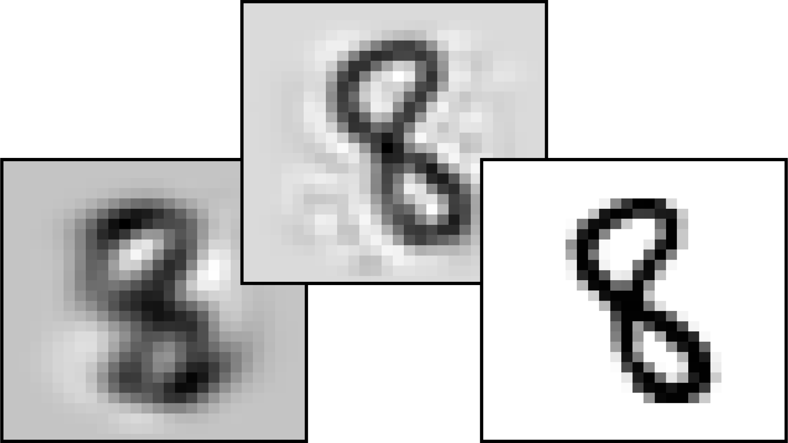

# QuantumReservoirComputing.jl

<div align="center">
    
    &nbsp;&nbsp;&nbsp;
    
    &nbsp;&nbsp;&nbsp;
    
</div><br>
<div align="center">
<a href="https://doi.org/10.5281/zenodo.15783754"></a>
&nbsp;
<a href="LICENSE"></a>
&nbsp;
<a href="https://github.com/alex180500/QuantumReservoirComputing.jl/releases/latest"></a>
&nbsp;
<a href="https://github.com/alex180500/QuantumReservoirComputing.jl/releases/latest"></a>
<a href=".JuliaFormatter.toml"></a>
</div><br>

**QuantumReservoirComputing.jl** is a package for quantum reservoir computing (QRC) and quantum extreme learning machines (QELM), written in [Julia](https://julialang.org/) by [_Alessandro Romancino_](https://github.com/alex180500). This package (as for now) provides tools for:
- Quantum states (especially qubits), quantum measurements, correlations and entanglement
- Very fast partial trace interface for qubits and general multipartite systems
- Various quantum utils functions, quantum encodings and quantum hamiltonians
- QRC and QELM algorithms
- Simple neural networks via [Flux.jl](https://fluxml.ai/Flux.jl/stable/)
- Some simple complex network and graph theory functions

> [!IMPORTANT]
> This package is under early development. The API may change frequently, some feature are not yet implemented, and the documentation is still a work in progress. If you have any questions feel free to [open an issue](https://github.com/alex180500/QuantumReservoirComputing.jl/issues/new/choose).

## Example Usage

Here's a complete example demonstrating how to use the library for quantum extreme learning with Haar random unitaries on the MNIST dataset.

First we import the necessary packages and set a random seed for reproducibility:
```jl
using QuantumReservoirComputing
using MLDatasets: MNIST
using Random: seed!
seed!(260625)
```
We now import the MNIST dataset and reshape it for processing (it will ask to be downloaded if you haven't used MLDatasets before):
```jl
train_x, train_y = MNIST(:train)[:]
test_x, test_y = MNIST(:test)[:]
train_data = reshape(train_x, 784, :)
test_data = reshape(test_x, 784, :)
```
We choose to encode the data using PCA, and we set the number of qubits to 8:
```jl
N = 8
dim = 2^N
train_pca, test_pca = pca_analysis(train_data, test_data, 2 * N)
```
The data is normalized from 0 to 1 and then encoded into quantum states using dense angle encoding:
```jl
encoding = hcat(rescale_data(train_pca, test_pca)...)
q_states = dense_angle_encoding(encoding[1:N, :], encoding[(N + 1):end, :])
```
Next, we generate a Haar random unitary matrix and compute the quantum reservoir outputs:
```jl
base_U = haar_unitary(dim)
reservoir_outputs = Float32.(qelm_compute(base_U, q_states))
```
Finally, we train a simple neural network using the quantum reservoir outputs and evaluate its performance:
```jl
results = nn_layer(reservoir_outputs, train_y, test_y; rate=0.1, epochs=100);
```
The output will show a bar with training and testing accuracies:
```
Training: 100%|████████████████████████| Time: 0:00:08
            Epoch: 100
             Loss: 0.9538
   Train Accuracy: 0.9514
    Test Accuracy: 0.9468
```

## Citations

If you find this package useful in your research, please consider citing it! You can use the following BibTeX entry:
```bibtex
@software{QuantumReservoirComputing.jl,
  author = {Alessandro Romancino},
  title = {QuantumReservoirComputing.jl: Quantum Reservoir Computing and Quantum Extreme Learning Machine package written in Julia.},
  month = mar,
  year = 2025,
  publisher = {Zenodo},
  doi = {10.5281/zenodo.15783753},
  url = {https://doi.org/10.5281/zenodo.15783753},
}
```
_More information can be found in QuantumReservoirComputing.jl Zenodo repository at [https://zenodo.org/record/15783753](https://zenodo.org/record/15783753)._

## License

This package is distributed under [Apache-2.0 License](LICENSE). **This means that you can use the code freely for academic, personal, or commercial purposes!** _If you use my code extensively, I would greatly appreciate if you could credit me by linking my GitHub profile [`@alex180500`](https://github.com/alex180500) or just reference me in any way._
